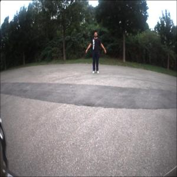
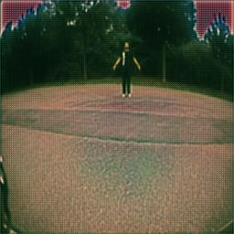

# CycleGAN for Ocean-to-Normal Image Translation

This project implements a CycleGAN for translating images between two domains: "normal" images and "ocean" images (images that mimic an underwater environment). The project utilizes TensorFlow for training, with custom generator and discriminator models. The CycleGAN framework is designed to handle unpaired image-to-image translation and can convert "normal" images to their "ocean" counterparts, and vice versa.

## Project Structure

```
├── cyclegan.py                # Main CycleGAN model class
├── discriminator_model.py     # Discriminator model class
├── generator_model.py         # Generator model class
├── utils.py                   # Helper functions for image preprocessing and postprocessing
├── README.md                  # Project overview and instructions
├── requirements.txt           # Python package requirements
└── data/                      # Directory for datasets
```

### Files

- **cyclegan.py**: Contains the `CycleGAN` class that orchestrates the training and image translation process. It includes methods for training, saving, and loading weights, as well as functions for transforming images.
  
- **discriminator_model.py**: Defines the `Discriminator` model. This is used to differentiate between real and generated images for both domains.
  
- **generator_model.py**: Defines the `Generator` model. This is used to generate images from one domain to another, for both normal-to-ocean and ocean-to-normal transformations.
  
- **utils.py**: Contains utility functions for preprocessing and postprocessing images (e.g., normalizing, resizing).

---

## CycleGAN Overview

CycleGAN is a type of Generative Adversarial Network (GAN) designed for unpaired image-to-image translation. It consists of two generators and two discriminators:
- **Generator G**: Transforms images from domain X (normal) to domain Y (ocean).
- **Generator F**: Transforms images from domain Y (ocean) to domain X (normal).
- **Discriminator X**: Classifies whether an image is a real image from domain X or a fake image generated by G.
- **Discriminator Y**: Classifies whether an image is a real image from domain Y or a fake image generated by F.

### Loss Functions
- **Adversarial Loss**: Encourages the generator to create realistic images that can fool the discriminators.
- **Cycle Consistency Loss**: Ensures that the image returned to its original domain (after two translations) is similar to the input.
- **Identity Loss**: Helps the model preserve the input when trying to transform an image into the same domain.

---

## How to Use

### Prerequisites

1. Clone this repository:
   ```bash
   git clone https://github.com/yourusername/cyclegan-ocean-normal.git
   cd cyclegan-ocean-normal
   ```

2. Install the required dependencies:
   ```bash
   pip install -r requirements.txt
   ```

3. Download or prepare your datasets, and place them inside the `data/` directory. Ensure you have two datasets: one for "normal" images (X) and one for "ocean" images (Y).

### Transforming Images

To convert an image from the normal domain to the ocean domain, use the `transform_to_ocean()` method. Similarly, to convert from the ocean domain back to normal, use `transform_to_normal()`.

```python
# Transform a normal image to the ocean domain
gan.transform_to_ocean("path/to/normal_image.jpg")

# Transform an ocean image to the normal domain
gan.transform_to_normal("path/to/ocean_image.jpg")
```

### Loading and Saving Weights

The model can load and save weights with the `load_weights()` and `save_weights()` methods:

```python
# Load weights
gan.load_weights("saved_weights")

# Save weights after training
gan.save_weights("saved_weights")
```

---

## Dataset

For this project, you need two separate datasets:
1. **Normal Images (X)**: A collection of standard images (non-underwater).
2. **Ocean Images (Y)**: A collection of underwater or oceanic images.

You can prepare your datasets in any format and organize them into folders within the `data/` directory.

---

## Results

Once trained, the model can be used to generate visually consistent transformations between the normal and ocean domains. Below is an example of transforming a normal image into the ocean domain:

| **Original Image (Normal)** | **Transformed Image (Ocean)** |
| --------------------------- | ---------------------------- |
|  |  |